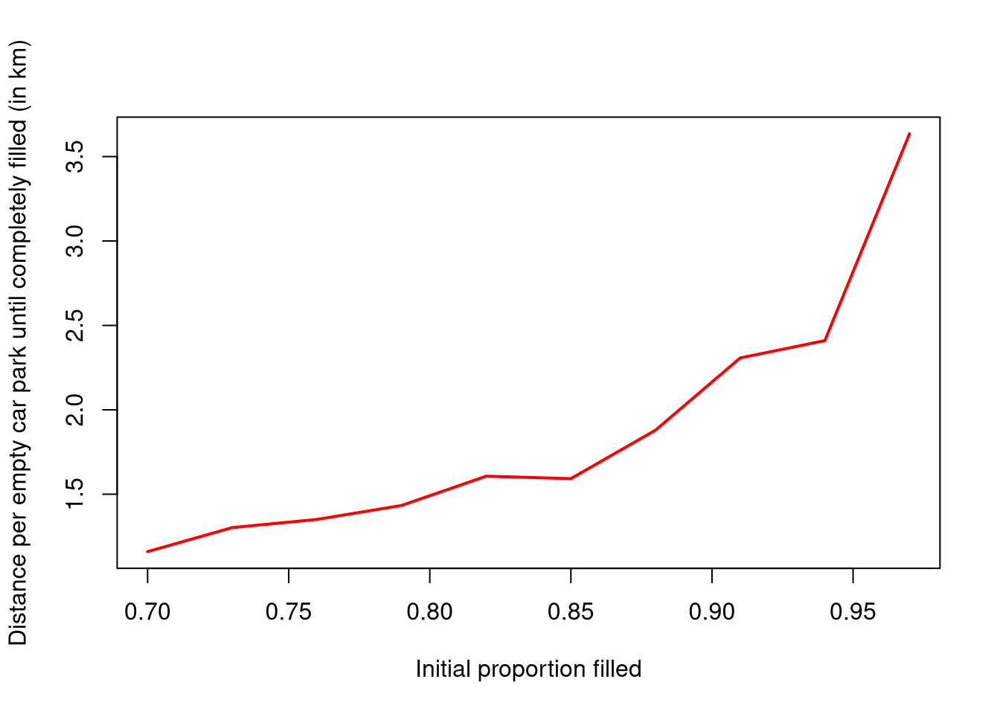

<!-- README.md is generated from README.Rmd. Please edit that file -->

[](https://github.com/UrbanAnalyst/superblock/actions/workflows/R-CMD-check.yaml)
[](https://app.codecov.io/gh/UrbanAnalyst/superblock)

# superblock

An R package to analyse potential
[superblocks](https://doi.org/10.1016%2Fj.cities.2024.105609). The
following example demonstrates the main functionality.

## Example

An example of the “Hansaviertel” of [Münster,
Germany](https://www.openstreetmap.org/#map=17/51.955569/7.639795). Note
that this entire document is dynamically-generated from the four lines
of code shown immediately below. All numerical values described in the
text are then taken from the actual data as downloaded from Open Street
Map (OSM) at the time the document was generated.

The first steps are to load the library and extract the necessary data:

``` r
library (superblock)
bbox <- c (7.63099, 51.95048, 7.66402, 51.96142)
hw_names <- c ("Bremer Straße", "Bremer Platz", "Wolbecker Straße", "Hansaring")
osmdat <- sb_osmdata_extract (bbox, hw_names)
```

### Summary

The following summary statistics are generated by this package:

-   Hansaviertel covers 23 Hectares
-   7.4% is public open space
-   15.7% is occupied by roads, of which:
    -   39.7% is used for parking cars, and
    -   27.7% is available for general public usage
-   There are only enough car parking spaces for 8.6% of all residents,
    who thereby occupy 39.7% of the total open street space.

There are several large public parking facilities very close to
Hansaviertel, and so cars could easily park there and free up this 39.7%
of the street space for use by everybody. That would increase the total
proportion of available public space by 97%. The average time needed to
drive to one of these parking facilities and walk back home within
Hansaviertel is 3.5 minutes. The results below show that times needed to
drive around searching for parking spaces generally exceed that once
around 90% of all parking spaces are full.

Moreover, this search for the 620 available parking spaces within
Hansaviertel amounts to the 8.6% of residents who are able to park
driving a total distance of around 186 km every evening to fill these
spaces. Were they to park in the nearby parking facilities, this total
distance would reduce to only 49 km. **By this measure, use of nearby
public parking facilities is 74% more efficient than this 39.7% of
available street space being otherwise used by only 8.6% of all
residents. Using nearby public parking facilities would also increase
space available for general public usage within Hansaviertel by 97%.**

Most of these results can easily be generated by calling the
`sb_summary()` function:

``` r
sb_summary (osmdat)
#> • Total area = 22.8 hectares
#> • Proportion buildings: 36.6%
#> • Proportion open space: 7.36%
#> • Proportion roads: 15.7%, of which:
#>   • 32.5% is for car roads
#>   • 39.7% is for parked cars, and
#>   • 27.7% remains for everybody else.
#> • There are street parking spaces for 8.6% of all residents.
#> • So 8.6% of residents occupy 39.7% of all space
#> 
#> • Total proportion of public space: 11.7
#> • Total proportion of public space as superblock: 23.1
#> • Increase in public space as superblock: 97%
```

The additional statistics described above on distances driven and times
taken to search for parking spaces are generated from functions
described in the following section.

------------------------------------------------------------------------

### Analysis of parking times

There are two additional functions to estimate how long people spend
driving around searching for car parking spaces, and how far they
actually drive.

#### Individual times search for parking spaces

The first function estimates the time taken on average for each resident
of the superblock to find a car parking space, as a function of the
proportion of available car parking spaces. Results are based on
simulations using actual data for the specified superblock to estimate
how long it takes on average to fill all of the remaining parking
spaces.

The results are compared to equivalent times to drive to the nearest
large parking facility (“garage” in the graph below), to park a car, and
then walk back to the place of residence.


``` r
times <- sb_parking_times (osmdat)
plot (times)
```

The results shows how long it takes to find a parking space for an
average attempt (“park(50%)”), for one out of every five attempts
(“park(80%)”, or one working day per week), and for one out of every ten
attempts (“park(90%)”, or one working day every two weeks). Above around
97-98% occupancy, which is the general state most nights, an “average”
attempt may still take under 5 minutes, yet one out of four times will
take 10 minutes or more, and one out of ten times it will take more than
half an hour. The horizontal lines shows the time it would take on
average for all residents of the area to drive directly to a nearby
large parking facility (“garage”), park, and walk back. Beyond around
95% occupancy, it is always quicker to park in a garage and walk back.

#### Total distances driven while searching for parking spaces

The average times to find parking spaces shown above are only high in
extreme cases (the 90% line), and when almost all parks are full.
Nevertheless, most parking spaces are indeed completely full most nights
of the week, suggesting the some people must experience these extremes
most days. An additional function estimates the total distances driven
by everybody while filling all parking spaces.

``` r
d <- sb_parking_km_per_empty (osmdat)
plot (d$prop_full, d$d,
    type = "l", col = "red", lwd = 2,
    xlab = "Initial proportion filled",
    ylab = "Distance per empty car park until completely filled (in km)"
)
```



Because filling the final few spaces takes so long, and people have to
drive so far to fill them, the overall distance driven to fill all
spaces is actually quite long. The block has around 620 parking spaces
in total, so with an initial proportion filled of 70%, people have to
drive a total of around 1km times 0.3 × 620 = 186km. While this may seem
extreme, consider that most of this distance is covered by the last few
people driving to find parking spaces, who are forced to drive several
kilometres. The longest street within the block is 1.3km, while one of
the surrounding streets is 3.0km. Ten people driving along both of those
streets will cover 43km, which is 23% of the total distance of 186 km
covered by that same number of drivers.

Or in terms of time, if the average driving speed while searching for a
parking space is 20km/hr, then those 186 people each take an average of
1/20th of an hour, or only 3 minutes, to find a park, yet aggregated
over all free parking spaces, that amounts to a total of 9.3 hours for
everybody to fill all remaining car parks.
